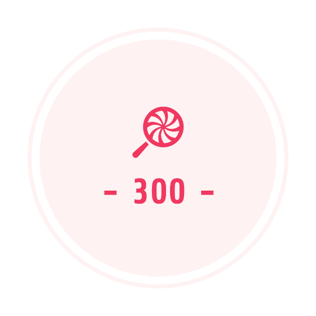

# [えんそくのおやつは300えんまで！](https://oyatsu300.com/)

# サービス概要
300円以内でおやつを選んで、結果をアプリ内もしくはTwitterで共有するアプリです。

## メインのターゲットユーザー
- おやつを懐かしいと感じるような人。
- Twitterユーザーが対象。
- 想定年代としては20代以降の男女

### ユーザーが抱える課題
特になし。ユーザーがおやつをきっかけに楽しい時間を過ごせれば良いなと思っています。

### 解決方法
おやつを選択し、カートに投入。結果をTwitterや本サービス内「みんなのおやつ」で共有する。

## なぜこのサービスを作ったか
友達との飲み会に駄菓子を持っていったら思いの外盛り上がり、その時の話題を元に本アプリを作成しました。  
大人になった今、300円以内で「ぼくのかんがえたさいきょうのおやつ」を考えるのは楽しそう。

## 遊び方
- 「あたらしくえらぶ」から好きなお菓子をクリック
- 決まったら「おかいけい」ボタンを押下して決定
- 結果を表示。任意でtwitter共有ができます。
- ログインするとアプリ内機能「みんなのおやつ」で他の人に自分が選んだおやつをみせびらかすことができます！

## 連絡先
何かありましたらお気軽にご連絡下さい。
- [times](https://chat.runteq.jp/runteq/channels/times_yamada_takatoshi)
- [Twitter](https://twitter.com/moyazine)
- [GitHub](https://github.com/TakatoshiYamada/oyatsu300)

## 外部資料
### 画面遷移図(初期案)
https://www.figma.com/file/UwepZFhub60nnhZ16Ugd21/ensoku-no-oyatsu-ha-300-yen-made?node-id=0%3A1

### ER図
https://drive.google.com/file/d/1J0Py7mTY_zP0ftL_MTqgxwzdHzGOZRZe/view?usp=sharing

## 環境
- ruby: v3.1.2
- rails: v6.1.6.1
- node.js: v18.7.0
- postgres: v14.3
- redis: v6.2.7

## セットアップ
- Redisを起動後、pumaを起動してください。

## 開発ルール
#### コミットメッセージルール
修正対応によって下記のメッセージを使い分けること。  
v1やv2などのバージョンごとの管理は廃止する。

- Add:     (機能- ファイルなどを)追加する
- Fix:     (コードなどを)修正する
- Improve: (コードなどを)改善する
- Update:  (パッケージやドキュメントなどを)更新する
- Remove:  (ファイル名やコードを)除去する
- Rename:  (ファイル名を)変更する
- Move:    (AをBに)移動する
- Change:  (AをBに)変更する

### イシュールール
ラベルから最適なものを選ぶこと。
